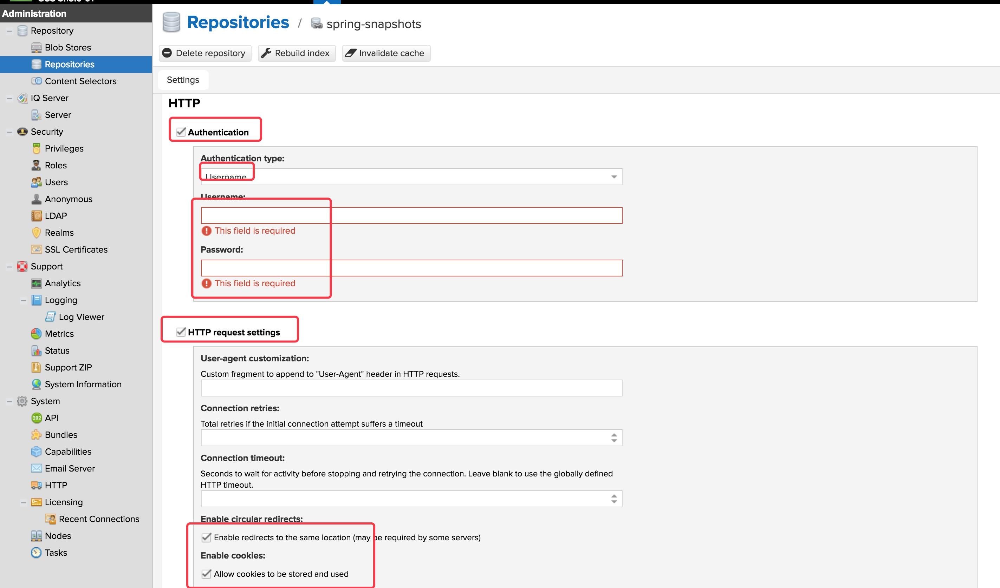

## nexux安装及配置Maven、pip、npm私服
#### 安装信息
- 操作系统 RedHat6.x(Centos6.x)
- nexus-oss版本 nexus-3.13.0-01-unix.tar.gz 
- JDK版本：JDK8
- 安装目录 /opt/software/nexus
- 应用目录 /opt/software/nexus/nexus-3.13.0-01
- 应用目录软连接 /opt/software/nexus/nexus
- 组件目录 /opt/software/nexus/sonatype-work
- 端口：8081（默认）
- nexus默认管理用户:admin/admin123
- nexus服务器域名：nexus.menghuanhua.com（配置方式略，用于在配置中表示nexus服务器）

#### 常用操作
/opt/software/nexus/nexus/bin/nexus {start|stop|run|run-redirect|status|restart|force-reload}
#### 安装步骤
- 服务器参数调整，关闭防火墙等，本文略
- 安装JDK8，本文略
- 安装nexus
    + 创建安装目录及下载目录  mkdir -p /opt/{software,install}
    + 下载Nexus Repository Manager OSS 3.x 社区版，下载地址：https://www.sonatype.com/download-oss-sonatype，并将下载文件保存到/opt/install目录
    + 创建nexus目录  mkdir -p /opt/software/nexus
    + 解压压缩包到目录 tar -xvf /opt/install/nexus-3.13.0-01-unix.tar.gz  -C /opt/software/nexus
    + 创建应用目录软链接，方便版本更新  ln -s /opt/software/nexus/nexus-3.13.0-01 /opt/software/nexus/
    + 启动nexus  /opt/software/nexus/nexus/bin/nexus start
    + 使用浏览器访问 http://127.0.0.1:8081，进入管理平台，安装完成。
- （可选）修改配置文件，并重启。配置文件如下：
```
    -Xms1200M
    -Xmx1200M
    -XX:MaxDirectMemorySize=2G
    -XX:+UnlockDiagnosticVMOptions
    -XX:+UnsyncloadClass
    -XX:+LogVMOutput
    -XX:LogFile=../sonatype-work/nexus3/log/jvm.log
    -XX:-OmitStackTraceInFastThrow
    -Djava.net.preferIPv4Stack=true
    -Dkaraf.home=.
    -Dkaraf.base=.
    -Dkaraf.etc=etc/karaf
    -Djava.util.logging.config.file=etc/karaf/java.util.logging.properties
    -Dkaraf.data=../sonatype-work/nexus3
    -Djava.io.tmpdir=../sonatype-work/nexus3/tmp
    -Dkaraf.startLocalConsole=false
```
- 进入管理平台，使用默认密码admin/admin123登录，并修改管理用户密码,如图
        
#### 配置Maven私服
- 打开管理平台，并使用管理用户登录。
- 进入管理页面，并进入仓库管理，对仓库进行增删。新装的nexus默认仓库如图。
        
- 配置仓库
一般情况下，maven私服的功能如下：
    + 代理中央仓库，默认的maven-central即中央仓库
    + 代理常用开源组件库，如spring（发布库/里程碑库/快照库）仓库、Oracle仓库
    + 建立私有仓库，分版本库和快照库，即默认的maven-releases和maven-snapshots
    + 建立third-party库，用于上传中央仓库没有，第三方的组件
    + 建立仓库组，便于配置使用，即默认的maven-public
默认的maven-central,maven-releases,maven-snapshots,maven-public可以直接使用，如果需要自定义名称，可以删除重新添加。本文仅保留maven-central，其余删除并重新添加，并分别命名为df-releases,df-snapshots,df-public。按照下表关键属性添加仓库：
    
        | 仓库名称 | 格式 | 类型 | 发布/快照库 | 是否允许重新发布 | 代理地址 |
        |:----------:|:-------:|:-----:|:--------:|:-------:|:----------|
        |maven-central|maven2|proxy|release|-|https://repo1.maven.org/maven2/|
        |df-releases|maven2|hosted|release|disabled redeploy|-|
        |df-snapshots|maven2|hosted|snapshot|allow redeploy|-|
        |third-party|maven2|hosted|release|disabled redeploy|-|
        |df-public|maven2|-|-|-|-|
        |spring-snapshots|maven2|proxy|snapshot|-|https://repo.spring.io/libs-snapshot-local|
        |spring-milestones|maven2|proxy|release|-|https://repo.spring.io/libs-milestone-local|
        |spring-releases|maven2|proxy|release|-|https://repo.spring.io/release|
        |maven.oracle.com|maven2|proxy|release|-|https://maven.oracle.com|

- 由于oracle仓库采用了认证，在按照上表特性进行配置后，需要进行特殊配置，配置方式如下。
    + 在oracle官网注册账户，注册地址：https://profile.oracle.com/myprofile/account/create-account.jspx
    + 在列表中，点击maven.oracle.com对应行，进入仓库配置。勾选如图的选项，并填入用户名和密码。
        
- 进入df-public，将其余hosted和proxy类型的仓库加入组中，如图：
        
- 配置好的仓库列表如图
        
- 在maven中配置使用nexus私服
    + 在setting.xml中配置
        * 配置将组建发布到仓库使用的用户名，在servers标签下配置，此处使用默认用户名密码举例，server下的id为nexus中配置的仓库名。
        ```
            <server>
              <id>df-releases</id>
              <username>admin</username>
              <password>admin123</password>
            </server>
            <server>
              <id>df-snapshots</id>
              <username>admin</username>
              <password>admin123</password>
            </server>
            <server>
              <id>third-party</id>
              <username>admin</username>
              <password>admin123</password>
            </server>
        ```

        * 定义私有仓库（可以在pom.xml中配置，但会令pom.xml显得啰嗦，所以优先配置在setting.xml中的profiles中并激活该profile）,完整的profiles和activeProfiles参考如下，根据实际情况替换http://nexus.menghuanhua.com:8081：
        ```
            <profiles>
                <profile>
                    <id>df-maven</id>
                    <repositories>
                        <repository>
                            <id>df-releases</id>
                            <name>df-releases</name>
                            <url>http://nexus.menghuanhua.com:8081/repository/df-releases/</url>
                            <layout>default</layout>
                            <snapshots>
                                <enabled>false</enabled>
                            </snapshots>
                            <releases>
                                <enabled>true</enabled>
                            </releases>
                        </repository>
                        <repository>
                            <id>df-snapshots</id>
                            <name>df-snapshots</name>
                            <url>http://nexus.menghuanhua.com:8081/repository/df-snapshots/</url>
                            <layout>default</layout>
                            <snapshots>
                                <enabled>true</enabled>
                                <updatePolicy>always</updatePolicy>
                            </snapshots>
                            <releases>
                                <enabled>false</enabled>
                            </releases>
                        </repository>
                        <repository>
                            <id>third-party</id>
                            <name>third-party</name>
                            <url>http://nexus.menghuanhua.com:8081/repository/third-party/</url>
                            <layout>default</layout>
                            <snapshots>
                                <enabled>false</enabled>
                            </snapshots>
                            <releases>
                                <enabled>true</enabled>
                            </releases>
                        </repository>
                    </repositories>
                </profile>
            <profiles>
            <activeProfiles>
                <activeProfile>df-maven</activeProfile>
            </activeProfiles>
        ```

        * 配置镜像，将对所有仓库的访问指向私服的仓库组
        ```
            <mirror>
                <id>df-public</id>
                <name>df-public</name>
                <url>http://nexus.menghuanhua:8081/repository/df-public/</url>
                <mirrorOf>*</mirrorOf>
            </mirror>
        ```

    + 在pom.xml中配置发布所使用的发布库及快照库，可以配置在父pom.xml中，继承父pom将继承该配置
        ```
            <distributionManagement>

                <repository>

                    <id>df-releases</id>

                    <name>Releases</name>

                    <url>http://nexus.menghuanhua:8081/repository/dz-kfb-release</url>

                </repository>

                <snapshotRepository>

                    <id>df-snapshots</id>

                    <name>Snapshot</name>

                    <url>http://nexus.menghuanhua:8081/repository/dz-kfb-snapshot</url>

                </snapshotRepository>

            </distributionManagement>
        ```
    + 发布组建
        按照上述配置完成后，使用mvn deploy即可将组件发布到自有私服。


            

